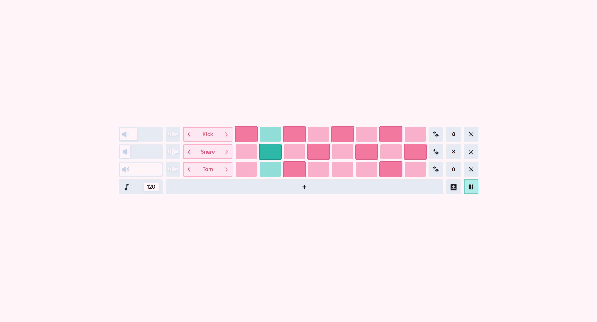
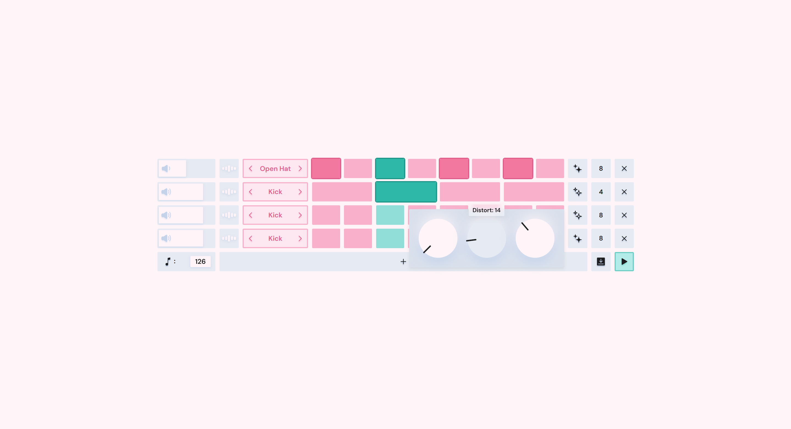

# Mini Studio
I created a tiny sequencer in react to help create simple beats and drum track without dealing with heavy software, ads, or anything else that makes making music difficult. This was created using the Tone library for react! I learned a ton of react syntaxes and how to use the Tone library while creating this.
## Features
 - Variable note lengths in tracks\
 - Three effects: distortion, delay, reverb
 - Simple and easy to use UI
 - Five drum options
 - Variable BPM
 - Save and load from JSON file
 ## Screenshots
